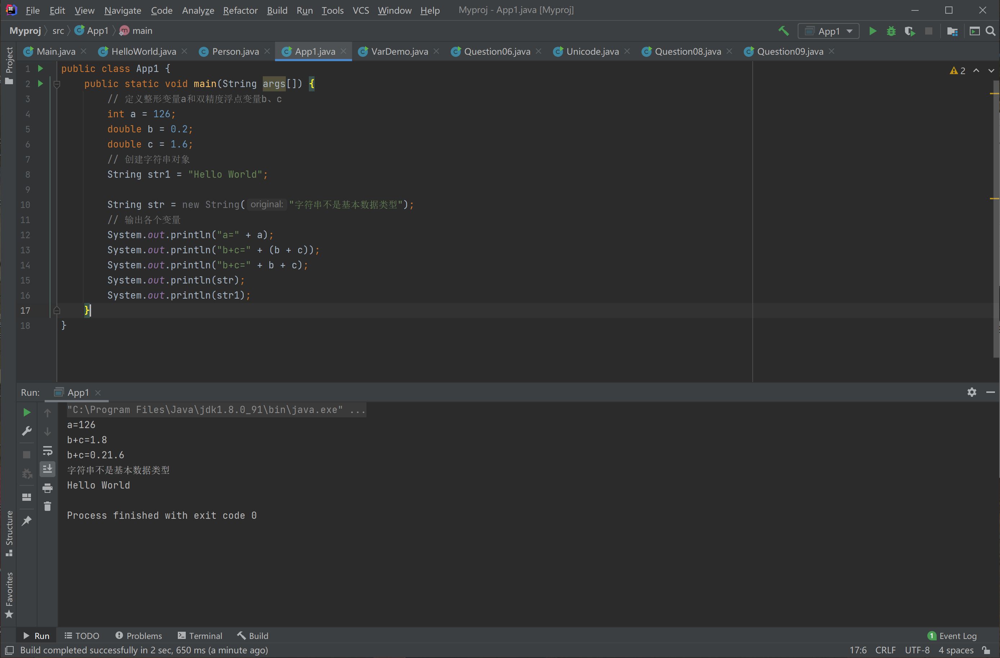
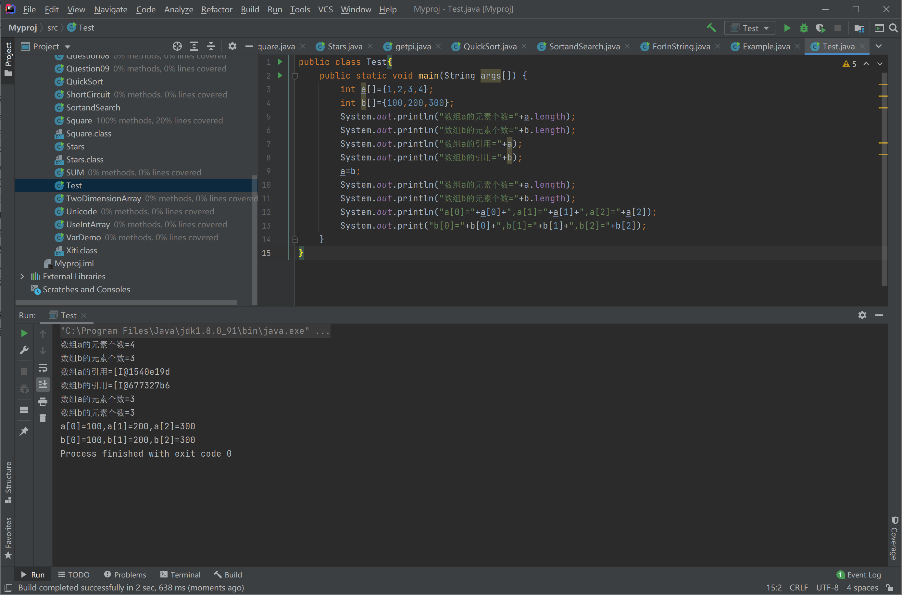

# Lab 01 Assignment

> 班级：192112
> 学号：19373073
> 姓名：何潇龙

## 1. 目录

```shell
-- 学号_姓名_lab01.zip
    |-- answer.pdf
    |-- oo
        |-- 1
            |-- 题1的代码文件(如果需要)

        |-- 2
            |-- 题2的代码文件(如果需要)
        |-- ...
```

## 2. Class 初步

Question01: 阅读下列 Java 源文件，并回答问题。

```java
public class Person {
    void speakHello() {
        System.out.print("您好，很高兴认识您");
        System.out.println(" nice to meet you");
    }
}

class Xiti {
    public static void main(String args[]) {
    Person zhang = new Person();
    zhang.speakHello();
    }
}
```

（a）上述源文件的名字是什么？

（b）编译上述源文件将生成几个字节码文件？这些字节码文件的名字都是什么？

（c）在命令行执行 `java Person` 得到怎样的错误提示？执行 `java xiti` 得到怎样的错误提示？执行 `java Xiti.class` 得到怎样的错误提示？执行 `java Xiti` 得到怎样的输出结果？

(a)Person.java

(b)2个。Person.class和Xiti.class

(c)

 `java Person`：错误: 在类 Person 中找不到 main 方法, 请将 main 方法定义为:
   public static void main(String[] args)
否则 JavaFX 应用程序类必须扩展javafx.application.Application

`java xiti` ：错误: 找不到或无法加载主类 xiti

`java Xiti.class`：错误: 找不到或无法加载主类 Xiti.class

`java Xiti` ：您好，很高兴认识您 nice to meet you

Question02: 编写程序输出自己的学号姓名，运行并截图。

```java
public class Main {
    public static void main(String[] args){
        System.out.println("19373073");
        System.out.println("何潇龙");
    }
}
```


## 3. IDE 的使用

Question03: (1). 编写以下程序，并运行。将运行结果截图提交。(2). 将断点设置在第八行，查看变量 a 的值，提交此刻的屏幕截图。

```java
public class HelloWorld {
    public static void main(String[] args) {
        System.out.println("Hello World!");
        int a = 1;
        a=a+1;
        a=a+2;
        System.out.println("a is " + a);
        a=a+3;  //断点行
        a=a+4;
        System.out.println("a is " + a);
    }
}
```

(1)


(2)


## 4. 基本数据类型

Question04: 看程序输出结果,并提交结果内容或截图

```java
public class App1 {
    public static void main(String args[]) {
        // 定义整形变量a和双精度浮点变量b、c
        int a = 126;
        double b = 0.2;
        double c = 1.6;
        // 创建字符串对象
        String str1 = "Hello World";

        String str = new String("字符串不是基本数据类型");
        // 输出各个变量
        System.out.println("a=" + a);
        System.out.println("b+c=" + (b + c));
        System.out.println("b+c=" + b + c);
        System.out.println(str);
        System.out.println(str1);
    }
}
```



Question05: 看程序输出结果,并提交结果内容或截图

```java
public class VarDemo {
    public static void main(String[] args) {
        byte b = 0x55;
        boolean B = true;
        short s = 0x55ff;
        int i = 1000000;
        long l = 0xffffL;
        char c = 'c';
        float f = 0.23F;
        double d = 0.7E-3;
        String S = "This is a string";
        System.out.println("字节型变量 b = " + b);
        System.out.println("短整型变量 s = " + s);
        System.out.println("整型变量 i = " + i);
        System.out.println("长整型变量 l = " + l);
        System.out.println("字符型变量 c = " + c);
        System.out.println("浮点型变量 f = " + f);
        System.out.println("双精度变量 d = " + d);
        System.out.println("布尔型变量 B = " + B);
        System.out.println("字符串对象 S = " + S);
    }
}
```


Question06: 编写一段代码验证 Java 中类的基本数据类型字段（成员变量）的默认初始化值，请按照对应类型的字面量填写。

**验证程序**：

```java
  public class Question06 {
    byte b;
    boolean B;
    short s;
    int i;
    long l;
    char c;
    float f;
    double d;
    String S;
    public static void main(String[] args) {
        Question06 question06 = new Question06();
        System.out.println("字节型变量 b = " + question06.b);
        System.out.println("短整型变量 s = " + question06.s);
        System.out.println("整型变量 i = " + question06.i);
        System.out.println("长整型变量 l = " + question06.l);
        System.out.println("字符型变量 c = " + question06.c);
        System.out.println("浮点型变量 f = " + question06.f);
        System.out.println("双精度变量 d = " + question06.d);
        System.out.println("布尔型变量 B = " + question06.B);
        System.out.println("字符串对象 S = " + question06.S);
    }
}
```


| 基本类型  | 默认值 | 基本类型    | 默认值 |
| :-------- | :----: | :---------- | :----: |
| **byte**  |   0    | **boolean** | false  |
| **short** |   0    | **char**    | (null) |
| **int**   |   0    | **float**   |  0.0   |
| **long**  |   0    | **double**  |  0.0   |

## 5. Unicode 编码

Question07: 看程序输出结果,并提交结果内容或截图

```java
public class Unicode {
    public static void main(String args[]) {
        char c = '大';
        System.out.println("\'" + c + "\'的Unicode编码：" + (int) c);
        int num = 23398;
        System.out.println("Unicode编码为" + num + "的字符是：" + (char) num);
    }
}
```


Question08: 编写一个 Java 应用程序，给出汉字‘你’、‘我’、‘他’在 Unicode 表中的位置。

**编写程序**

```java
public class Question08 {
    public static void main(String args[]) {
        char c = '我';
        System.out.println("\'" + c + "\'的Unicode编码：" + (int) c);
        c = '你';
        System.out.println("\'" + c + "\'的Unicode编码：" + (int) c);
        c = '他';
        System.out.println("\'" + c + "\'的Unicode编码：" + (int) c);

    }
}
```

运行结果：


Question09: 以 unicode 存储的 char。编写静态方法`String unicodeFormOf(char ch)`，需求如下：

```java
/**
 * @param ch 任何unicode字符
 * @return 格式为\\uxxxx的字符串，xxxx为小写的四位十六进制数且等值于ch在unicode表中的位次
**/
public static String unicodeFormOf(char ch);
```

**样例：**

| ch  | System.out.println(unicodeFormOf(ch)) |
| :-- | :-----------------------------------: |
| 冲  |               `\u51b2`                |
| a   |               `\u0061`                |

**题外话：**

注释中使用了两个反斜线是因为 Java 源代码中可以用\uxxxx 的格式插入 unicode 字符，比如`\u0061 = 1`等价于`a = 1`。'x'并不是合法的 16 进制字符，不对反斜线进行转义的话，题目中的注释会无法通过编译。

其实只写一行代码就可以解决此题。有兴趣的同学可以尝试一下。

**代码：**

```java
public class Question09 {
    public static String unicodeFormOf(char ch)
    {
        String convert=Integer.toHexString((int)ch);
        String ans="\\u";
        int i=convert.length();
        while(i<4)
        {
            ans=ans+"0";
            i++;
        }
        ans=ans+convert;
        return ans;
    }
    public static void main(String args[]) {
        char c = '冲';
        System.out.println(unicodeFormOf(c));
        c = 'a';
        System.out.println(unicodeFormOf(c));
    }
}
```


## 6. 三元运算符

Question10: 看程序输出结果,并提交结果内容或截图

```java
public class FindMinMax{
    public static void main(String []args)
    {
        double temp, max, min;
        double d1=1,d2=-9.9,d3=96.9;
        temp=d1>d2?d1:d2;
        temp=temp>d3?temp:d3;
        max=temp;
        temp=d1<d2?d1:d2;
        temp=temp<d3?temp:d3;
        min=temp;
        System.out.println("max="+max);
        System.out.println("min="+min);
    }
}
```

执行结果：


## 7. 短路

Question11: 阅读下面这段代码：

```java
// ShortCircuit.java
public class ShortCircuit {
    static void print(String s) {
        System.out.println(s);
    }
    static boolean test1(int val) {
        print("1");
        return val < 1;
    }
    static boolean test2(int val) {
        print("2");
        return val < 2;
    }
    static boolean test3(int val) {
        print("3");
        return val < 3;
    }
    public static void main(String[] args) {
        boolean b = test1(0) && test2(2) && test3(2);
        print("b is " + b);
    }
}
```

运行 java ShortCircuit，程序的输出是什么？

请解释 Java 执行串联逻辑运算时的流程，可以用文字、流程图、伪代码描述。

思考如何利用短路这个机制来优化程序。

(1)输出见下图：


(2)给b赋值时，先执行test1(0),结果是1，接下来是test2(2)，结果为0。因为三个元素之间是“与”的关系，b必定为零，所以跳过了test(3)。

(3)在这道题目中可以先将结果可能为“0”的判断提前，可以改写成：

```boolean b =  test2(2) && test1(0) && test3(2);```

## 8. 全局变量

Question12: 看程序输出结果,并提交结果内容或截图

```java
public class GlobalVar {
    int a = 10; // 全局变量,下同
    double b = 20;

    public static void main(String[] args) {
        GlobalVar globalVar = new GlobalVar();
        System.out.println("全局变量  a = " + globalVar.a);
        // System.out.println("全局变量  a = " +a); 错误写法
        globalVar.print();
        System.out.println("全局变量变化后  a = " + globalVar.a);
    }

    public void print() {
        System.out.println("在print()中, 全局变量　a = " + a + ", b = " + b);
        a = 30;
        System.out.println("在print()中, 全局变量　a = " + a + ", b = " + b);
    }
}
```


## 9. 局部变量

Question13: 看程序输出结果,并提交结果内容或截图

```java
public class LocalVar {
    public static void main(String[] args) {
        LocalVar localVar = new LocalVar();
        // System.out.println("局部变量 a = " + localVar.a); 引用错误，下同
        localVar.print();
        // System.out.println("变化后的局部变量  a = " + localVar.a);
    }

    public void print() {
        int a = 10; // 局部变量，下同
        double b = 20;
        System.out.println("在print()中的局部变量　a = " + a + ", b = " + b);
        a = 30;
        System.out.println("在print()中的局部变量　a = " + a + ", b = " + b);
    }
}
```


## 10. 数组

Question14: 看程序输出结果,并提交结果内容或截图

```java
public class UseIntArray {
    public static void main(String[] args) {
        int intArray[] = { 8, 9, 12,13,14};
        int sum = 0;
        for (int i = 0; i < intArray.length; i++)
            sum += intArray[i];
        for (int i = 0; i < intArray.length; i++)
            System.out.println("intArray[" + i + "]=" + intArray[i]);
        System.out.println();
        System.out.println("sum=" + sum);
    }
}
```


Question15: 看程序输出结果,并提交结果内容或截图:

```java
class TwoDimensionArray {
    public static void main(String args[]) {
        int b[][] = { { 11 }, { 21, 22 }, { 31, 32, 33 } };
        int sum = 0;
        b[0][0] = 1000;
        for (int i = 0; i < b.length; i++) {
            for (int j = 0; j < b[i].length; j++)
                sum += b[i][j];
        }
        System.out.println("b[0][0]=" + b[0][0] + '\n' + "sum=" + sum + '\n'
                + "b.lengh=" + b.length);

        int arr1[][] = new int[3][4];
        int arr2[][] = new int[3][];
        int arr3[][] = { { 0, 1, 2 }, { 3, 4, 5 }, { 6, 7, 8 } };
        int i, j, k = 0;

        // arr1[][]赋值
        for (i = 0; i < 3; i++)
            // arr1为3行4列
            for (j = 0; j < 4; j++)
                arr1[i][j] = k++;

        // arr2[][]开辟内存空间
        for (i = 0; i < 3; i++)
            // arr2每一行是变长的，元素个数为3、4、5
            arr2[i] = new int[i + 3];
        // arr2[][]赋值
        for (i = 0; i < 3; i++)
            for (j = 0; j < arr2[i].length; j++)
                arr2[i][j] = k++;

        // 输出arr1
        System.out.println(" arr1:");
        for (i = 0; i < 3; i++)
            for (j = 0; j < 4; j++)
                System.out.print(" " + arr1[i][j]);
        System.out.println();

        // 输出arr2
        System.out.println(" arr2:");
        for (i = 0; i < 3; i++)
            for (j = 0; j < arr2[i].length; j++)
                System.out.println(" " + arr2[i][j]);

        // 输出arr3
        System.out.println(" arr3:");
        for (i = 0; i < 3; i++)
            // arr3为3行3列
            for (j = 0; j < 3; j++)
                System.out.print(" " + arr3[i][j]);
    }
}
```


## 11. switch

Question16: 阅读下面程序，给出程序的输出结果，为什么？

```java
public class E {
    public static void main (String args[ ]) {
        char c = '\0';
        for(int i=1;i<=4;i++) {
            switch(i) {
            case 1:  c = 'J';
                    System.out.print(c);
            case 2:  c = 'e';
                    System.out.print(c);
                    break;
            case 3:  c = 'p';
                    System.out.print(c);
            default: System.out.print("好");
            }
        }
    }
}
```


输出```Jeep好好```

i=1的时候输出case1的```J```，但case1里没有break，因此紧接着输出case2里的```e```。

i=2的时候输出case2的```e```，此时有break。

i=3的时候输出case3的```p```，case3里没有break，因此紧接着输出default里的```好```。

i=4的时候输出default的```好```。

因此最后输出```Jeep好好```

## 12. 循环

Question17: 分别用 do-while 和 for 循环计算 1+1/2!+1/3!+1/4!… … 的前 20 项和。

**代码：**

```java
public class SUM {
    public static void main(String args[]) {
        int i=0;
        double sum=0,factorial=1;
        do{
            i++;
            factorial*=i;
            sum+=1/factorial;
        }while(i<20);
        System.out.println("do-while:"+sum);
        
        i=0;sum=0;factorial=1;
        
        for(i=1;i<=20;i++) {
            factorial*=i;
            sum+=1/factorial;
        }
        System.out.println("for:"+sum);
    }
}
```

运行结果：


Question18: 请实现程序输出以下 5\*5 数字方格。

```plain
1 2 3 4 5
6 7 8 9 10
11 12 13 14 15
16 17 18 19 20
21 22 23 24 25
```

需要在 main 函数的输入参数中设置 5，输出$5*5$的数字方格。如果是输入 7，则是$7*7$的数字方格。需要提交代码及运行结果截图。

**代码：**

```java
public class Square {
    public static void main(String args[]) {
        int a = Integer.parseInt(args[0]);
        int i;
        for(i=1;i<=a*a;i++)
        {
            System.out.print(i+" ");
            if(i%a==0)  System.out.print("\n");
        }
    }
}
```

运行结果：


Question19: 请实现程序输出以下星塔.

需要在 main 函数的输入参数中设置 5，输出 5 层星塔。如果是输入 7，则输出 7 层星塔。假设输入参数都是奇数，且都大于等于 5，小于等于 11，提交代码及运行结果截图。

（我不确定是不是要满足这里的空格要求！因为样例里左端空格好像比直接输出多了几个，总之我理解是输入是几第一行就空几个空出来）

```plain
     *
    ***
   *****
    ***
     *
```

**代码：**

```java
public class Stars {
    public static void main(String args[]) {
        int a = Integer.parseInt(args[0]);
        int i,j;
        for(i=0;i<a;i++)
        {
            for(j=0;j<a-Math.abs(a/2-Math.abs(a/2-i));j++)
            {
                System.out.print(" ");
            }
            for(j=0;j<(a-2*Math.abs(a/2-i));j++) {
                System.out.print("*");
            }
            System.out.print("\n");
        }
    }
}
```

运行结果：


Question20: 编写静态方法 double getPi(int n)，利用公式$\pi = 4\sum_{i=0}^{n}{\frac{\left(-1\right)^{i}}{2i+1}}$，求 pi 的近似值，需求如下

```java
/**
   * 利用公式\pi = 4\sum_{i=0}^{n}{\frac{\left(-1\right)^{i}}{2i+1}}求指定精度的圆周率
   * 如果n是负数，视其为0
   * @param n 公式中的i的上限
   * @return 圆周率的近似值
   */
   public static double getPi(int n);

```
**代码**
```java
public class getpi {
    public static double getPi(int n){
        if(n<0) n=0;
        int i;
        double pi=0;
        for(i=0;i<=n;i++){
            pi+=Math.pow(-1,(double)i)/(double)(2*i+1);
        }
        pi*=4;
        return pi;
    }
    public static void main(String args[]) {
        int n=2000;
        System.out.println(getPi(n));
    }
}
```

运行结果：


**题外话：**

如果 n 是负数，视其为 0

有穷求和的区间是闭区间，上限 n 对应的级数项也是要被计算的。

Question21: 快速排序

编写静态方法`int[] qsort(int[] arr)`，需求如下：

```java
   /**
   * 对一个int数组进行快速排序，结果是升序的，并且不会开辟额外的数组空间
   * @param arr 待排序的数组
   * @return 升序排列好的arr，如果arr==null，则返回null
   */
   public static int[] qsort(int[] arr);

```
**代码：**
````java
public class QuickSort {
    public static int[] qsort(int arr[]){
        if(arr==null) return null;
        else{
            int n=arr.length;
            if(n==0) return arr;
            quick(arr,0,n-1);
            return arr;
        }
    }
    public static void quick(int k[],int left,int right)
    {
        int i, j,tmp;
        int pivot;
        if(left<right){
            i=left; j=right+1;
            pivot = k[left];
            while(true){
                while(k[++i]<pivot && i!=right);
                while(k[--j]>pivot && j!=left);
                if(i<j)
                {
                    tmp=k[i];
                    k[i]=k[j];
                    k[j]=tmp;
                }
                else break;
            }
            tmp=k[left];
            k[left]=k[j];
            k[j]=tmp;
            quick(k,left,j-1);
            quick(k,j+1,right);
        }
    }
    public static void main(String args[]) {
        int a[]={12,45,67,89,123,-45,67};
        qsort(a);
        int n=a.length;
        for(int i=0;i<n;i++)
        System.out.print(a[i]+" ");
    }
}
````

输出结果：


**约束：**

返回值必须是原数组，即 `return arr`。

可以任意次创建指向原数组的引用，但是请不要在排序过程中创建新的数组。

可以根据需要定义新的函数。

如果数组是 `null`，返回 `null。`

对于空数组(`arr.length==0`)，原样返回，而不是 `null。`

**这一次请不要使用 java.util.Array.sort()之类的操作。**

Question22: 现有一组数据分别是：12,45,67,89,123,-45,67，实现以下两步：

(1) 请对这组数据排序后，按照从小到大的顺序打印；

(2) _从键盘输入任意整数_，程序判断该整数是否存在该数组中；
**代码**
```java
import java.util.Scanner;

public class SortandSearch {
    public static int[] qsort(int arr[]){
        if(arr==null) return null;
        else{
            int n=arr.length;
            if(n==0) return arr;
            quick(arr,0,n-1);
            return arr;
        }
    }
    public static void quick(int k[],int left,int right)
    {
        int i, j,tmp;
        int pivot;
        if(left<right){
            i=left; j=right+1;
            pivot = k[left];
            while(true){
                while(k[++i]<pivot && i!=right);
                while(k[--j]>pivot && j!=left);
                if(i<j)
                {
                    tmp=k[i];
                    k[i]=k[j];
                    k[j]=tmp;
                }
                else break;
            }
            tmp=k[left];
            k[left]=k[j];
            k[j]=tmp;
            quick(k,left,j-1);
            quick(k,j+1,right);
        }
    }
    public static boolean bisearch(int arr[], int n) {
        int left = 0, right = arr.length - 1, mid;
        while (left <= right) {
            mid = (left + right) / 2;
            if (n == arr[mid]) {
                return true;
            }
            if (n > arr[mid])
                left = mid + 1;
            else
                right = mid - 1;
        }
        return false;
    }
    public static void main(String args[]) {
        int a[]={12,45,67,89,123,-45,67};
        qsort(a);
        int n=a.length;
        for(int i=0;i<n;i++)
            System.out.print(a[i]+" ");
        Scanner input = new Scanner(System.in);
            int query = input.nextInt();
            if(bisearch(a,query)) System.out.println("yes");
            else System.out.println("no");
    }
}
```
输出结果：


Question23: 阅读下面代码并查看输出结果

```java
public class ForInString {
  public static void main(String[] args) {
    for(char c : "An African Swallow".toCharArray())
      System.out.print(c + " ");
  }
}
```

输出结果：


## 13. 引用

Question24: 阅读下面这段代码：

```java
class Point {
    int x,y;
    void setXY(int m,int n){
        x = m;
        y = n;
    }
}
public class Example {
    public static void main(String args[]) {
        Point p1,p2;
        p1=new Point();
        p2=new Point();
        System.out.println("p1的引用:"+p1);
        System.out.println("p2的引用:"+p2);
        p1.setXY(1111, 2222);
        p2.setXY(-100, -200);
        System.out.println("p1的x,y坐标:"+p1.x+","+p1.y); // 1
        System.out.println("p2的x,y坐标:"+p2.x+","+p2.y); // 2
        p1 = p2;
        p1.setXY(0, 0);
        System.out.println("p1的引用:"+p1);
        System.out.println("p2的引用:"+p2);
        System.out.println("p1的x,y坐标:"+p1.x+","+p1.y); // 3
        System.out.println("p2的x,y坐标:"+p2.x+","+p2.y); // 4
    }
}
```

请指出代码中注释标注出的四行输出的内容会是什么。

输出：


1:p1的x,y坐标:1111,2222

2:p2的x,y坐标:-100,-200

3:p1的x,y坐标:0,0

4:p2的x,y坐标:0,0

**题外话：**

意在理解 Java 对象实例是作为引用存在的。

如果你要为一个类实现 `copy()` 方法，思考如何避免引用间赋值导致的浅拷贝？或者说，如何确保进行的是**深拷贝**。你需要查一下什么是**浅拷贝**？什么是**深拷贝**？

浅拷贝是复制了对象的地址，深拷贝需要把对象的每一个属性全部都复制过去。

同样的问题也存在于 String 的 `==` 和 `equals()` 方法，对于不同的背景，相等的定义可能也不同。

Question25: 阅读下面程序，给出程序的输出结果，为什么？

```java
public class Test{
    public static void main(String args[]) {
        int a[]={1,2,3,4};
        int b[]={100,200,300};
        System.out.println("数组a的元素个数="+a.length);
        System.out.println("数组b的元素个数="+b.length);
        System.out.println("数组a的引用="+a);
        System.out.println("数组b的引用="+b);
        a=b;
        System.out.println("数组a的元素个数="+a.length);
        System.out.println("数组b的元素个数="+b.length);
        System.out.println("a[0]="+a[0]+",a[1]="+a[1]+",a[2]="+a[2]);
        System.out.print("b[0]="+b[0]+",b[1]="+b[1]+",b[2]="+b[2]);
    }
}
```

输出结果：



原因：

因为a=b是一个浅拷贝，相当于只是把对象b的地址给了a而已，因此所有对于b的改动都会体现在a上。

## 14. 可变参数

Question26: 看程序输出结果,并提交结果内容或截图:

```java
public class E {
    public static void main(String args[]) {
        f(1,2);
        f(-1,-2,-3,-4); //给参数传值时，实参的个数很灵活
        f(9,7,6) ;
    }
    public static void f(int ... x){    //x是可变参数的代表，代表若干个int型参数
        for(int i=0;i<x.length;i++) {  //x.length是x代表的参数的个数
            System.out.println(x[i]);  //x[i]是x代表的第i个参数(类似数组)
        }
    }
}
```


Question27: 编写静态方法`String strscat(String... args)`，需求如下：

```java
/**
   * 将任意个字符串顺序连接，不应该改变任意一个原有参数
   * @param args 字符串们
   * @return args中的字符串顺序连接组成的新字符串
   */
   public static String strscat(String... args);

```

**样例：**

| 调用方法                        | 返回值 |
| :------------------------------ | :----: |
| strscat("a", "b", "c", "", "e") | "abce" |
| strscat("str")                  | "str"  |

**代码**

```java
public class addstring {
    public static String strscat(String... args){
        String a="";
        for(int i=0;i<args.length;i++){
            a+=args[i];
        }
        return a;
    }
    public static void main(String args[]) {
        System.out.print(strscat("a", "b", "c", "", "e"));
        System.out.print(strscat("str"));
    }
}
```

**回答：**

请尝试理解 Java 可变参数的实现机制。

将可变参数当作数组存入。

调用`strscat(new String[]{"a", "b"})`能通过编译吗？

能

如果还有静态方法`String strscat(String[] args)`同时存在，代码能编译通过吗？这时传入的参数是什么？又会返回什么？

不能通过。传入的是字符串数组，返回字符串。

如果我们声明的是`String strscat(String[] args)`，`strscat()`这样的调用还能通过编译吗？如果能，这时传入参数和返回值的情况和`String strscat(String... args)`通过相同吗？

单纯`strscat()`的调用没法通过编译，没有参数。

## 15. 面向对象（复习并完成课堂知识点）

Question28: **减肥**。小王本来体重 70Kg，经过减肥，体重降到 45Kg，试从这个问题领域中识别对象、类、属性、行为、状态，和状态变化。尝试将你抽象出来的类用 Java 代码实现出来，并编写一个测试类，来描述上述过程。

```java
class person{
    private String name;
    private int weight;
    public void setweight(int weight){
        this.weight=weight;
        System.out.print(this.name+"的体重是"+weight+"kg\n");
    }
    public void setname(String name){
        this.name=name;
        System.out.print("这个人的名字叫"+this.name+"\n");
    }
    public void loseweight(int weight){
        this.setweight(weight);
        System.out.print(this.name+"减肥减到了"+weight+"kg\n");
    }
}
public class Question28 {
    public static void main(String args[]) {
        person wang=new person();
        wang.setname("小王");
        wang.setweight(70);
        wang.loseweight(45);
    }
}
```

Question29: **制作一桌丰盛的年夜饭**。定义采购员类和厨师类的属性和行为，在测试类中产生采购员的对象：姑姑，妈妈和你，在测试类中产生出厨师的对象：爸爸和婶婶，协同制作年夜饭。

```java
class buyer{
    private String name;
    private String vegetable;
    public void setname(String name){
        this.name=name;
        System.out.print(this.name+"是采购员\n");
    }
    public void buythings(String vegetable){
        this.vegetable=vegetable;
        System.out.print(this.name+"负责"+this.vegetable+"\n");
    }
}
class cook{
    private String name;
    private String cookings;
    public void setname(String name){
        this.name=name;
        System.out.print(this.name+"是厨师\n");
    }
    public void cookthings(String cookings){
        this.cookings=cookings;
        System.out.print(this.name+"负则"+this.cookings+"\n");
    }
}
public class Question29 {
    public static void main(String args[]) {
        buyer auntA=new buyer();
        buyer mom=new buyer();
        buyer me=new buyer();
        cook dad=new cook();
        cook auntB=new cook();
        auntA.setname("姑姑");
        auntA.buythings("买肉");
        mom.setname("妈妈");
        mom.buythings("买菜");
        me.setname("我");
        me.buythings("买鸡蛋和佐料");
        dad.setname("爸爸");
        dad.cookthings("烹饪");
        auntB.setname("婶婶");
        auntB.cookthings("烤甜品");
    }
}
```

