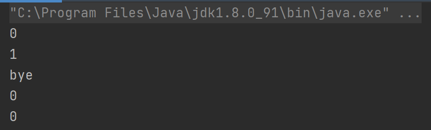

# Java 程序设计 Lab02

```java
/**
 * 学号:19373073
 * 姓名:何潇龙
 * JDK版本:jdk1.8.0_91
 * 代码文件编码方式:UTF-8
 * IDE:IDEA
 */
```

## 实验目的

- 理解并掌握类的概念
- 理解并掌握对象的概念
- 理解类与对象的关系
- 理解面向对象中抽象过程
- 理解面向对象中的消息
- 理解 Java 程序的基本结构并能灵活使用
- 理解并掌握 Java 类的定义（成员变量、成员方法和方法重载）
- 理解并掌握 Java 类的构造函数（默认构造函数、带参数构造函数），理解重
  载的构造函数并灵活使用
- 理解 Java 垃圾内存自动回收机制
- 理解并掌握 Java 类变量和类方法

## 实验题目

### 1. 简答题

#### Problem

编译下面这个类：

```java
public class Sample {
    int x; // 1
    long y = x; // 2
    public void f(int n) {
        int m; // 3
        int t = n + m; // 4
    }
    public static void main(String[] args) {
        Sample t=new Sample();
        t.f(5);
        System.out.println(t.x);
    }
}
```

注释标记的哪些行会导致编译错误，为什么?

#### Solution

第四行会出现错误，因为m是方法里的变量，类里的变量作为“属性”是有默认的初始值的，但方法里的变量需要给予初始赋值，否则没法运行。

### 2. overload

#### Problem

阅读下面代码：

```java
public class Overload{
    Overload(int m){}
    Overload(double  m){}
    int Overload(int m){return 23;}
    void Overload(double m){}
}
```

对于`Overload`类，下面哪些叙述是错误的，为什么错？

- a. `Overload(int m)`与`Overload(double m)`互为重载的构造方法。
- b. `int Overload(int m)`与`void Overload(double m)`互为重载的非构造方法。
- c. `Overload`类有 2 个构造方法，尝试调用默认构造方法`Overload()`会无法通过编译。
- d. `Overload`类有 3 个构造方法。

#### Solution

d，没有返回类型且和类同名的方法是构造方法，这里只有两个。没有编写构造方法的时候系统会默认该类只有一个默认构造方法，但如果已经写了构造方法，就不会有默认构造方法了，所以仍然只有两个构造方法。

### 3. overload2

#### Problem

阅读下面这段代码：

```java
public class Overload2 {
    int a,b;
    int c=-1;
    public Overload2(){a=-2;}
    public Overload2(int p1,int p2){a=p1;  b=p2;}
    public Overload2(int p1,int p2,int p3){
      this(p1,p2);
      c=p3;
    }

    @Override
    public String toString(){
      return String.format("(a,b,c)=(%d,%d,%d)",a,b,c);
    }
    public static void main(String args[]){
      Overload2 s = new Overload2();
      System.out.println(s);
      System.out.println(new Overload2(5,6));
      System.out.println((new Overload2(2,3,4)).toString());
    }
  }

```

运行`java Overload2`，程序的输出是什么？

**题外话：**

根据`void java.io.PrintStream.print()`系列函数的实现，当传入的 String 或 Object 是 null 时，最后都会导致输出字符串”null”，而不是什么都不输出。

进行字符串连接时也一样：” ”+null 的结果是”null”。

因此当涉及相关操作时需要稍微注意一下。

具体原因参见`java.io.PrintStream`、`java.lang.String`的源代码。

#### Solution

输出结果：

```java
(a,b,c)=(-2,0,-1)
(a,b,c)=(5,6,-1)
(a,b,c)=(2,3,4)
```

### 4. 简答题 finalize

#### Problem

阅读下面这段代码：

```java
public class User {
    public static int userCount = 0;
    public User() {
        ++userCount;
    }

    @Override
    protected void finalize() throws Throwable {
        super.finalize();
        System.out.println("bye");
        --userCount;
    }
    public static void main(String[] args) {
        System.out.println(User.userCount); // 1
        User u = new User();
        System.out.println(User.userCount); // 2
        u = null;
        System.out.println(User.userCount); // 3
        System.gc();
        System.out.println(User.userCount); // 4
    }
}
```

注意代码中用注释标出的四行`System.out.println(User.userCount)`，某些行的输出结果有多种可能。

运行`java User`，程序的输出可能是什么？

| 注释标记行 | 可能的输出内容 |
| :--------: | :------------: |
|     1      |   见solution   |
|     2      |                |
|     3      |                |
|     4      |                |

有什么办法可以让`finalize()`在`main()`结束前一定被调用吗？

**题外话：**

和 C++不同，在 Java 中显式重写 `finalize()` 通常是不必要的。

`java.lang.System.gc()`只会在需要的时候执行垃圾收集，你的调用只是一个“建议”。

#### Solution

可能的输出1：

| 注释标记行 | 可能的输出内容 |
| :--------: | :------------: |
|     1      |       0        |
|     2      |       1        |
|     3      |       1        |
|     4      |       1        |

可能的输出2

| 注释标记行 | 可能的输出内容 |
| :--------: | :------------: |
|     1      |       0        |
|     2      |       1        |
|     3      |       1        |
|     4      |   bye(换行)0   |

在调用gc()的时候不一定会立刻执行垃圾回收，因此finalize可能在调用gc()后立刻执行，也可能在main整个结束之后再执行。

让`finalize()`在`main()`结束前一定被调用的方法：显式的调用finalize，例如如下代码就可以实现：

```
public static void main(String[] args) throws Throwable {
    System.out.println(User.userCount); // 1
    User u = new User();
    System.out.println(User.userCount); // 2
    u.finalize();
    System.out.println(User.userCount); // 3
    System.gc();
    System.out.println(User.userCount); // 4
}
```

输出效果：



### 5. 编程题

写一个音乐类，并编写测试类显示音乐信息（音乐名称、音乐类型）。编写一个手机类，
并编写测试类显示手机信息（手机品牌、手机型号）

```java
class Music{
    String name;
    String type;
    public String getName() {
        return name;
    }
    public void setName(String name) {
        this.name = name;
    }
    public String getType() {
        return type;
    }
    public void setType(String type) {
        this.type = type;
    }
    @Override
    public String toString() {
        return "Music{" +
                "name='" + name + '\'' +
                ", type='" + type + '\'' +
                '}';
    }
}
class Phone{
    String brand;
    String type;
    public String getBrand() {
        return brand;
    }
    public void setBrand(String brand) {
        this.brand = brand;
    }
    public String getType() {
        return type;
    }
    public void setType(String type) {
        this.type = type;
    }
    @Override
    public String toString() {
        return "Phone{" +
                "brand='" + brand + '\'' +
                ", type='" + type + '\'' +
                '}';
    }
}
public class Test {
    public static void main(String[] args)  {
        Music music = new Music();
        music.setName("One Last Kiss");
        music.setType("EVA‘s ED");
        System.out.println(music);
        Phone phone = new Phone();
        phone.setBrand("Apple");
        phone.setType("iPhone12");
        System.out.println(phone);
    }
}
```

```java
目录名为：5
文件名有：Test.java
```

### 6. 编程题

编写程序,在其中定义两个类：

- Person 类：
  - 属性有 name、age 和 sex
  - 提供你认为必要的构造方法
  - 方法 `setAge()` 设置人的合法年龄 (0~130)
  - 方法 `getAge()` 返回人的年龄
  - 方法 `work()` 输出字符串“working”
  - 方法 `showAge()` 输出 age 值
- TestPerson 类：
  - 创建 Person 类的对象，设置该对象的 name、age 和 sex 属性
  - 调用 `setAge()` 和 `getAge()` 方法，体会 Java 的封装性。
  - 创建第二个对象，执行上述操作，体会同一个类的不同对象之间的关系。

```java
class Person{
    String name;
    int age;
    String sex;
    public String getName() {
        return name;
    }
    public void setName(String name) {
        this.name = name;
    }
    public int getAge() {
        return age;
    }
    public void setAge(int age) {
        if (age>=0 && age<=130) this.age = age;
        else
        {
            System.out.println("Please recheck the name");
        }
    }
    public String getSex() {
        return sex;
    }
    public void setSex(String sex) {
        this.sex = sex;
    }
    public void work(){
        System.out.println("working");
    }
    public void showAge(){
        System.out.println(this.name+"'s age is"+this.age);
    }

    @Override
    public String toString() {
        return "Person{" +
                "name='" + name + '\'' +
                ", age=" + age +
                ", sex='" + sex + '\'' +
                '}';
    }
}
public class TestPerson {
    public static void main(String[] args) {
        Person Ayanami = new Person();
        Ayanami.setName("AyanamiRei");
        Ayanami.setAge(19);
        Ayanami.setSex("Female");
        System.out.println(Ayanami.getAge());
        Person Asuka = new Person();
        Asuka.setName("AsukaLangley");
        Asuka.setAge(19);
        Asuka.setSex("Female");
        System.out.println(Asuka.getAge());
    }
}
```

```java
目录名为：6
文件名有：TestPerson.java
```

### 7. 编程题

编写一个 Java 命令行程序，**只从标准输入读取一行用户输入**，判断这行输入是否是一个没有前导 0 的无符号整数；如果是，则还要判断该数字是否是一个回文数。输出你的判断和执行结果。

对于“没有前导 0 的无符号整数”的定义：

- 是一个字符串 s
- s 的长度至少是 1，没有上限要求
- s 的字符集 Σ={0, 1, 2, 3, 4, 5, 6, 7, 8, 9}，其他所有字符都不应该出现在 s 中
- 当 s 的长度大于 1 时，若从其首部开始有若干个连续字符 0，那么这些字符 0 都叫做 s
  的“前导 0”
  - 比如数字串 00010020，有三个前导 0
  - 比如数字串 01，有 1 个前导 0
  - 比如数字串 102030，没有前导 0
  - 比如数字串 0，没有前导 0

本题对于回文数的定义：

- 是一个字符串 s
- s 的长度至少是 1，没有上限要求
- s 的字符集 Σ={0, 1, 2, 3, 4, 5, 6, 7, 8, 9}，其他所有字符都不应该出现在 s 中
- 将 s 中的字符逆序排列并去除前导 0 得到的数字串 r，有 s 和 r 完全相同
  - s=123 时，r=321，不相同，s 和 r 都不是回文数
  - s=12321 时，r=12321，相同，s 是回文数
  - s=12100 时，r=121，不相同，s 不是回文数，但 r 是回文数
  - s=1 时，r=1，相同，s 是回文数
  - s=0 时，r=0，相同，s 是回文数

本题将输入的一行字符视为一个完整的字符串，如果输入的是诸如“121 121”这样包含空格的串，虽然 121 是回文数，但是整个串不应该被认为是回文数。如果将字符集扩充为包含空格的其他字符集，那么“121 121”就是一个该字符集下的回文串，不过本题的字符集限定为由 0~9 这十个数字组成的字符集。

```java
import java.util.Scanner;

public class PalindromicNumber {
    public static void main(String[] args) {
        Scanner input = new Scanner(System.in);
        String words = input.nextLine();
        char [] numbers = words.toCharArray();
        for (char number : numbers) {
            if (!Character.isDigit(number)) {
                System.out.println("不是一个无符号整数");
                System.exit(0);
            }
        }
        if(numbers.length==1) {
            System.out.println("是一个回文数");
        }
        else{
            if (numbers[0]=='0'){
                System.out.println("不是一个没有前导 0 的无符号整数");
                System.exit(0);
            }
            else
            {
                for(int i=0,j=numbers.length-1;i<=j;i++,j--)
                {
                    if(numbers[i]!=numbers[j]){
                        System.out.println("是一个没有前导 0 的无符号整数，但不是回文数");
                        System.exit(0);
                    }
                }
                System.out.println("是一个回文数");
                System.exit(0);
            }
        }
    }
}
```

```java
目录名为：7
文件名有：PalindromicNumber.java
```

