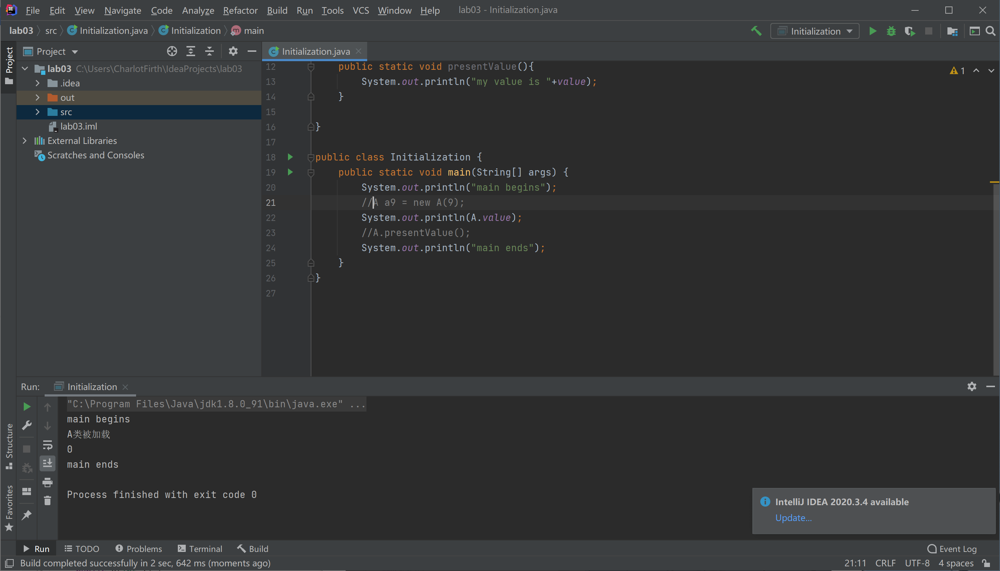

# Java 程序设计 LAB03

```java
/**
 * 学号:19373073
 * 姓名:何潇龙
 * JDK版本:jdk1.8.0_91
 * 代码文件编码方式:UTF-8
 * IDE:IDEA
 */
```

## 实验目的

- 理解封装含义
- 理解信息隐藏的必要性
- 掌握访问控制修饰符的使用
  - 私有成员（变量和方法）的理解和使用
  - 共有成员的理解和使用
  - 保护成员的理解和使用
  - 使用不加任何权限修饰符的成员
- 加深对“类和对象”的理解

## 注意事项

建议建立一个自己的统一且良好的**代码风格**，比如**命名风格**（camelCase、snake_case 等）、缩进方式（空格数量、switch-case 缩不缩进等）、开闭大括号换不换行等容易引发战
争（迫真）的东西，以养成良好的编程习惯。

编程题最好为每一个类编写一个完备的测试类，覆盖尽可能多的输入、函数调用、输出，以证明代码正确实现了功能。

如果编程题使用了 package 语句，应当确保提交时目录结构和 package 语句表达的包结构相同。（IDE 很多时候会帮你做）

编程题在给出了具体需求的情况下，**可以根据自己的需要添加额外的方法**。

## 实验题目

### 初始化 I

阅读下面这段代码，尝试理解 Java 中初始化的顺序：

```java
class A {
    int value;
    static A a1 = new A(1);
    public A(int i) {
        System.out.println("initialize A"+i);
        value = i;
    }

    public A(A a) {
        System.out.println("copy from A"+a.value);
        value = a.value;
    }
    static A a2 = new A(2);

}

class B {
    A a8;
    // A a7 = new A(a6);
    A a6 = new A(6);
    static A a3 = new A(3);
    static A a4;
    static {
        a4 = new A(4);
    }
    static A a5 = new A(5);

    public B(int i) {
        System.out.println("initialize B"+i);
        a8 = new A(8);
    }
    A a7 = new A(a6);
}

public class Initialization {
    static B b1 = new B(1);
    static B b2;
    public static void main(String[] args) {
        System.out.println("main begins");
        A a9 = new A(9);
        b2 = new B(2);
        System.out.println("main ends");
    }
}
```

#### Q1

> 阅读这段代码，请问程序的输出是什么？

```java
initialize A1
initialize A2
initialize A3
initialize A4
initialize A5
initialize A6
copy from A6
initialize B1
initialize A8
main begins
initialize A9
initialize A6
copy from A6
initialize B2
initialize A8
main ends
```

#### Q2

对于非静态属性，它的初始化方法有两种：

- 在属性定义处显式初始化（如本例中的 a6）；
- 在构造方法或非静态方法中初始化（如本例中的 a8）；

> 这段代码能够证明“在属性定义处初始化的属性，比在方法中初始化的属性先被初始化”吗？

可以，因为在B的静态属性初始化结束之后，先执行的是Initialization部分静态属性b1的初始化，在这之后才进行的A8的初始化

> 这段代码能够证明“在属性定义处初始化的属性，初始化顺序等同于他们在类定义中出现的顺序”吗？

（如果是指非静态属性的话）可以。（如果是指所有属性的话）不可以，还和前面的关键词有关，static修饰的属性会先比默认的属性先初始化，比如这个例子里A5是被static修饰的，它的初始化顺序比没有static修饰但出现得更早的A6要早

#### Q3

> 请尝试仿照 Q2 的内容，描述静态属性的初始化方式和实际初始化时的顺序。

**初始化的方式：**

1. 在属性定义处显式初始化（如A1）
2. 先声明属性，再在静态代码块里初始化（如A4）

**初始化的顺序：**

按照出现（声明）顺序的先后初始化


#### Q4

> 已知 static 属性的初始化、static 块的执行，只在 JVM 进行类加载的时候执行。这段代码能够证明 “在类的实例第一次被构造、或类的静态属性和静态方法第一次被访问时，JVM 会执行类加载”吗？如果不能，请尝试修改代码并证明。

没有办法证明。因为该程序的输出只能说明在生成实例的时候调用了相应的函数，不能说明加载了这个类。

将代码修改如下：

```java

class A {
    static
    {
        System.out.println("A类被加载");
    }
    static int value;
    public A(int i){
        value = i;
        System.out.println("initialize A"+i);
    }
    public static void presentValue(){
        System.out.println("my value is "+value);
    }

}
//在验证的时候，三条代码加注释的代码只保留一条
public class Initialization {
    public static void main(String[] args) {
        System.out.println("main begins");
        A a9 = new A(9);//用于验证类的实例第一次被构造时会类加载
        System.out.println(A.value);//用于验证类的静态属性第一次被访问时会类加载
        A.presentValue();//用于验证类的静态方法第一次被访问时会类加载
        System.out.println("main ends");
    }
}
```

**验证类的实例第一次被构造时会类加载的截图：**


**验证类的静态属性第一次被访问时会类加载的截图：**



**验证类的静态方法第一次被访问时会类加载的截图：**


```
目录名为：Q4
文件名有：Initialization.java
```


#### 题外话

懒加载：lazy load，对某资源只在需要时才寻找其存在并初始化；对立面是预加载。

预加载：提前加载好所有资源，等待使用资源的那一刻。

对于一些使用频率较低但初始化开销很大的资源，懒加载可以避免他们给程序的初始化增加过多的负担。

JVM 的类加载是懒加载，只有在程序第一次使用到某个类时才去尝试读取其.class 文件。类加载只会进行一次，这一次类加载会完成所有的静态初始化工作。更多内容会在后续课程讲解 RTTI 和反射的时候提到。

在游戏编程中，当某一个类的所有实例都使用同一批贴图文件时，可以将贴图资源声明为 static 属性并直接（或在 static 块）初始化。让类的贴图属性引用这些静态资源，这样就可以避免为每一个对象构造单独的贴图文件导致的内存浪费和时间浪费。

### 单例模式

阅读下面这段代码，它实现了经典设计模式之一————单例模式（singleton pattern）：

```java
/**
 * Singleton 一个最简单的单例模式的实现
 */
public class Singleton {
    private static Singleton uniqueInstance = new Singleton();

    private Singleton() {
    }

    public static Singleton getInstance() {
        return uniqueInstance;
    }

    public void foo() {
        System.out.println("Aha!");
    }
}
```

#### Q1

> 其他的外部类可以通过`new Singleton()`来构造一个新的`Singleton`变量吗？

不可以，构造函数的访问权限是private，仅可以被本类内被调用

#### Q2

> 本题给出的 Singleton 类的写法被称为单例模式，是因为这个类最多只可能有 1 个实例同时存在。为什么只可能有 1 个？这个唯一的实例在什么时候被构造？

只有一个实例是因为在执行程序的一开始给Singleton类分配内存的时候，静态属性也会被分配内存且被初始化。第一句``` private static Singleton uniqueInstance = new Singleton();```就已经构造了一个实例。除此之外，首先本Singleton类里不再有生成实例，其次因为构造函数的方问权限是private，所以其他类也没有办法生成实例。唯一获取该实例的方式是通过Singleton类里提供的getInstance方法获取那生成好的唯一一个实例。

#### Q3

> 请写出任意一种外部类调用 Singleton 类的 foo()的方法。

```java
public static void main(String[] args){
    Singleton.getInstance().foo();
}
```

#### 题外话

这里的 uniqueInstance 初始化方法不是懒加载（lazy load）的，因为 uniqueInstance 在类加载时就被初始化了，虽然我们可能最终并用不到它。你可以思考一下如何实现一个懒加载的单例模式。

希望以后还有机会简单提一下设计模式(design pattern)。
