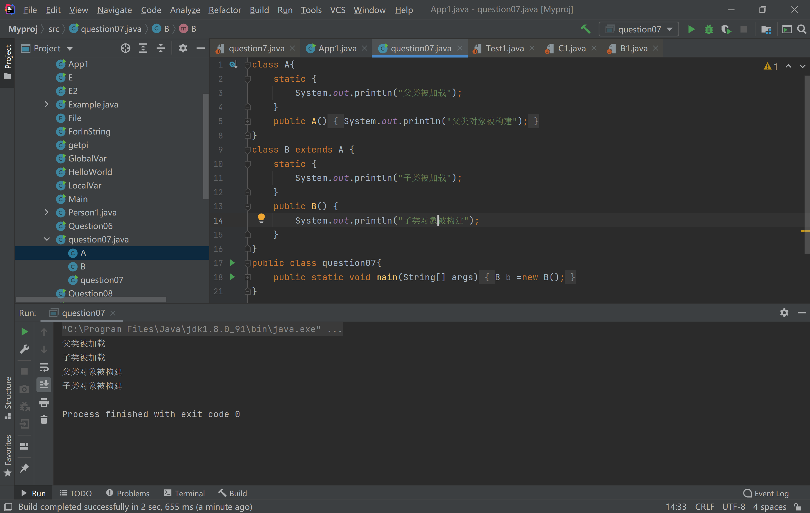
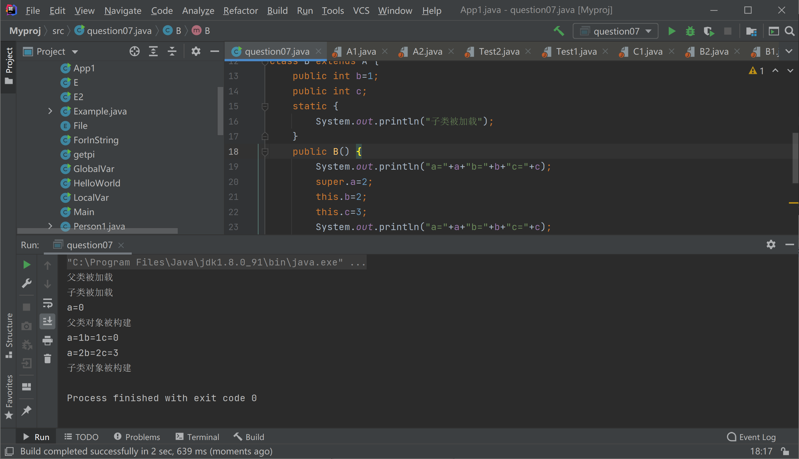

# Java程序设计 LAB04

```java
/**
* 学号:19373073
* 姓名:何潇龙
* JDK版本:jdk1.8.0_91
* 代码文件编码方式:UTF-8
* IDE:IDEA
 */
```


### 1.  package

你在A.java添加的语句

```java
package com.oo.aa;
```

你在B.java添加的语句

```java
package com.oo.bb;
import com.oo.aa.*;
```

你在C.java添加的语句

```java
package com.oo.cc;
import com.oo.bb.*;
```

你在Main.java添加的语句

```java
package com.oo;
import com.oo.cc.*;
```

你在BTest.java添加的语句

```java
package test;
import com.oo.bb.*;
```


### 2.  权限

已注释掉不能编译的代码，在02文件夹下新建了bin文件夹，编译语句为：

```sh
javac -cp . -d ./bin ./a/*.java
javac -cp . -d ./bin ./b/*.java
```

之后使用

```shell
java -cp ./bin/ 包名.类名
```

查看执行情况。

LAB03中的`Singleton`类可能有子类吗？

> 不可以，因为子类无法继承构造方法，也无法重写构造方法。

final类可以被视为所有构造方法都是private的类吗？

> 不可以。final类仅仅是不能被继承而已，类本身的实例仍然是可以在类外生成的。而private的构造方法在类外是不可以被调用的，因此在类外无法生成实例。

记得把不能编译的代码注释掉并提交

### 3.  Hide&Override

执行`java Test`，程序的运行结果是什么？

> 4
> 4
> 5
> foo() of Parent
> foo() of Child
> foo() of Child
> bar() of Parent
> bar() of Parent
> bar() of Child

如果将子类的`protected void foo()`改为默认访问权限，程序还能通过编译吗？

> 不能

如果将子类的`protected void bar()`改为默认访问权限，程序还能通过编译吗？

> 不能

foo 和 bar 的测试输出结果表现一致吗？

> 不一致

属性、静态方法、非静态方法，哪些可以override，哪些可以被隐藏？

> 可被重写的：
>
> 非静态方法
>
> 可被隐藏的:
>
> 属性、静态方法


### 4.  Hide&Override

在不添加新的属性的情况下，子类想要实现自己的calcArea()该怎么办

使用getter方法获取私有属性再进行计算：

```java
class Rectangle extends Shape {

    public Rectangle(double a, double b) {
        super(a, b);
    }

    public double calcArea() {
        return super.getA() * super.getB();
    }
}

class Rhombus extends Shape {
    public Rhombus(double a, double b) {
        super(a, b);
    }

    public double calcArea() {
        return super.getA() * super.getB() / 2;
    }
}

class Ellipse extends Shape {
    public Ellipse(double a, double b) {
        super(a, b);
    }

    public double calcArea() {
        return super.getA() * super.getB() * Math.PI;
    }
}
```


### 7. 初始化II

结合代码描述你的证明过程：

（1）

```java
class A{
    static {
        System.out.println("父类被加载");
    }

    public A() {
        System.out.println("父类对象被构建");
    }
}
class B extends A {
    static {
        System.out.println("子类被加载");
    }

    public B() {
        System.out.println("子类对象被构建");
    }
}
public class question7{
    public static void main(String[] args) {
        B b =new B();
    }
}
```



执行结果如下，易看出在加载子类的时候要先查看父类是否加载过，先加载父类在加载本类。

（2)

```java
class A{
    public int a;
    static {
        System.out.println("父类被加载");
    }
    public A() {
        System.out.println("a="+a);
        this.a=1;
        System.out.println("父类对象被构建");
    }
}
class B extends A {
    public int b=1;
    public int c;
    static {
        System.out.println("子类被加载");
    }
    public B() {
        System.out.println("a="+a+"b="+b+"c="+c);
        super.a=2;
        this.b=2;
        this.c=3;
        System.out.println("a="+a+"b="+b+"c="+c);
        System.out.println("子类对象被构建");
    }
}
public class question07{
    public static void main(String[] args) {
        B b =new B();
    }
}
```

执行结果如图所示：



从打印信息可以看出来先调用的父类再构造子类。父类执行结束后先执行的是显式赋值，因为构造中第一次打印结果b=1，若没有先执行显式赋值语句，那b打印出来的结果应该和c一样都是0，说明b的赋值先执行，然后才执行的构造体里其他的句子。