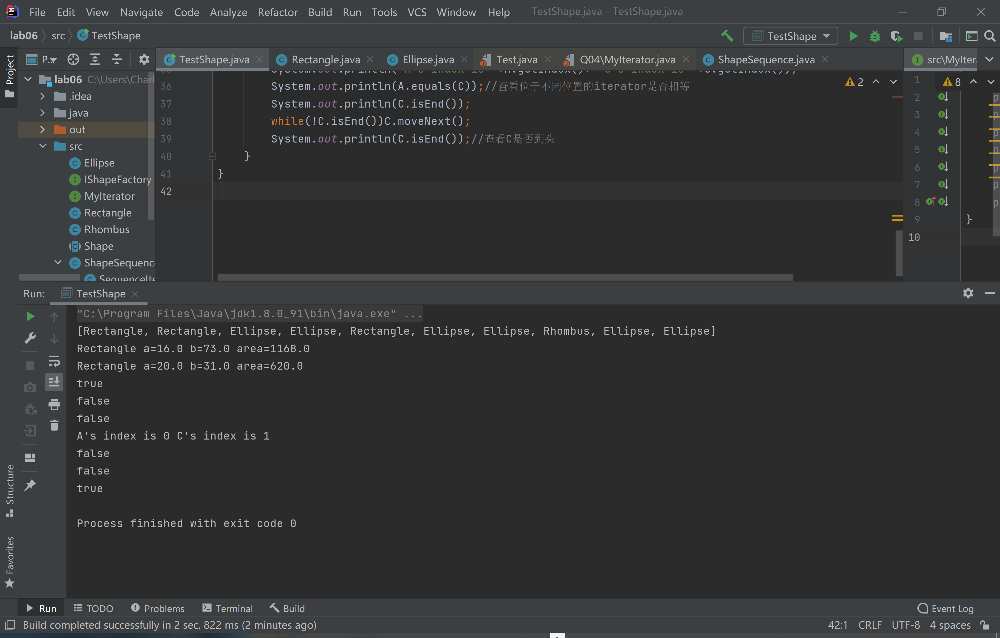

测试的入口为TestShape，代码如下，用途见注释：

```java
public class TestShape {
    public static void main (String[] args) {
        int count=10;//随机生成10个形状
        ShapeSequence List = new ShapeSequence(count);
        ShapeSequence List2 = new ShapeSequence(count);
        for (int i=0;i<count;i++) {
            int randomA = 1 + (int) (Math.random() * 100);//随机生成a
            int randomB = 1 + (int) (Math.random() * 100);//随机生成b
            int randomShape =1+(int) (Math.random() * 3);//指定生成的形状
            switch (randomShape){//在switch语句中根据指定形状的不同调用不同的工厂
                case 1:
                    List2.add(Rectangle.getFactory().makeShape(randomA, randomB));
                    List.add(Rectangle.getFactory().makeShape(randomA, randomB));
                    break;
                case 2:
                    List2.add(Rhombus.getFactory().makeShape(randomA, randomB));
                    List.add(Rhombus.getFactory().makeShape(randomA, randomB));
                    break;
                default:
                    List2.add(Ellipse.getFactory().makeShape(randomA, randomB));
                    List.add(Ellipse.getFactory().makeShape(randomA, randomB));
                    break;
            }
        }
        System.out.println(List);//toString功能是由isEnd、moveNext共同实现的，因此只要能正确打出List，说明这三个函数就正确执行。
        MyIterator A = List.iterator();
        MyIterator B = List2.iterator();
        MyIterator C = List.iterator();
        System.out.println(C.current());
        C.moveNext();
        System.out.println(C.current());//C的索引向后移一位，查看变化
        System.out.println(A.equals(A));
        System.out.println(A.equals(List));//查看不同类型的两个对象是否相等
        System.out.println(A.equals(B));//查看外类对象不同的对象是否相等
        System.out.println("A's index is "+A.getIndex()+" C's index is "+C.getIndex());
        System.out.println(A.equals(C));//查看位于不同位置的iterator是否相等
        System.out.println(C.isEnd());
        while(!C.isEnd())C.moveNext();
        System.out.println(C.isEnd());//查看C是否到头
    }
}
```

一个可能的执行结果如下：

