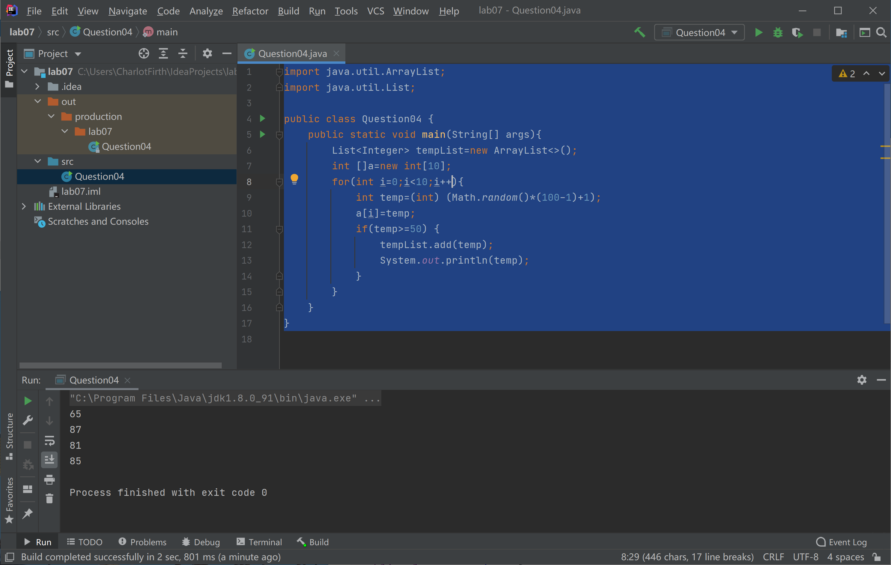
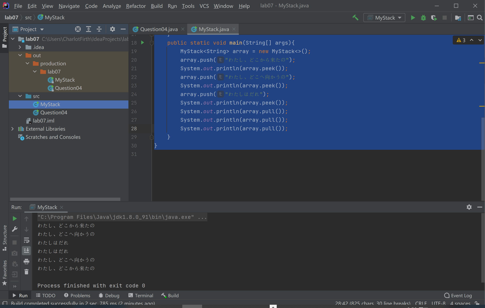
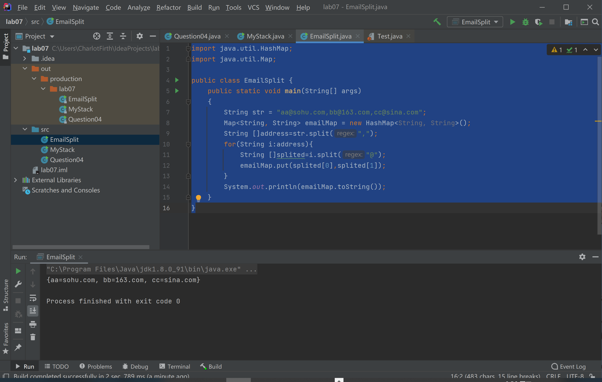
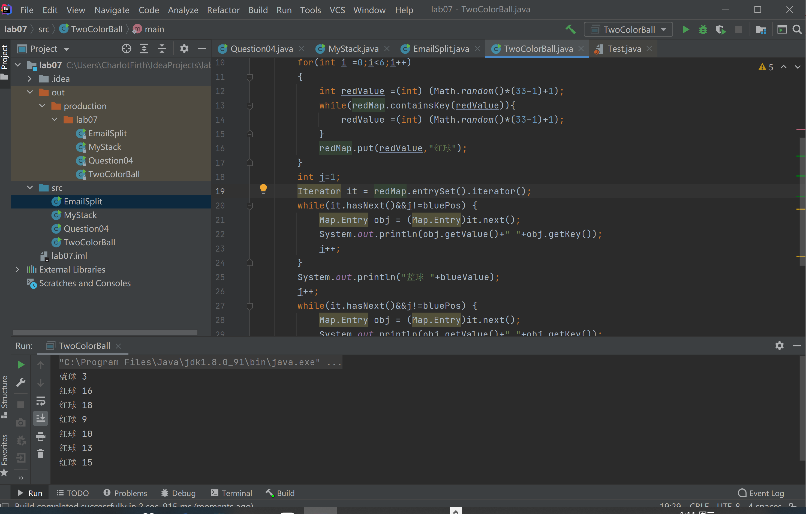
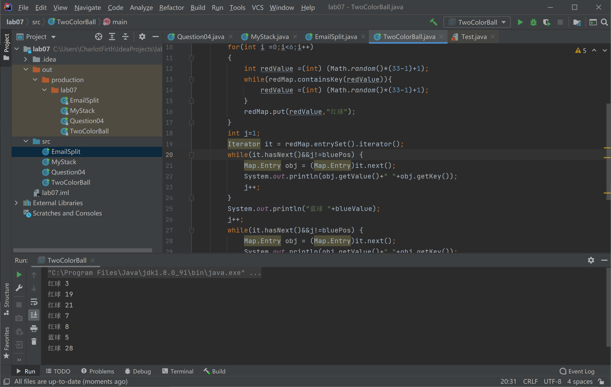

```java
/**
* 学号:19373073
* 姓名:何潇龙
* JDK版本:jdk1.8.0_91
* 代码文件编码方式:UTF-8
* IDE:IDEA
 */
```


# Java 程序设计 LAB07

## 实验目的

- 理解集合框架的设计思路

- 了解 Java 常用的数据结构类及其使用，重点迭代器(Iterator) 、线性表（List、ArrayList、LinkedList）、HashMap 类、HashSet 类及枚举类在企业级软件编写中经常用到，要求在理解的基础上，熟练掌握

- 理解泛型的概念、必要性并能够灵活使用

## 实验题目

### 1. 简述`ArrayList`和`LinkedList`的区别 `简答`

>ArrayList和Vector使用了数组的实现，可以认为ArrayList或者Vector封装了对内部数组的操作，比如向数组中添加，删除，插入新的元素或者数据的扩展和重定向，数组的优势是读取访问时可以根据索引直接找到，所以在读取的时候相比linkedlist快，但是删除需要逐个移动
>
>LinkedList使用了循环双向链表数据结构。linkedlist在删除的时候只需要修改下指针然后释放掉要删除的内容就可以了，所以一般用arrayList用作读取比较多的时候，而linkedList用在删除比较多的时候。

### 2. 写出以下程序的输出 `简答`

```java
//Animal.java
public class Animal {
    public Animal(){
        System.out.println("I am an animal");
    }
}

//Dog.java
public class Dog extends Animal{
    public Dog(){
        System.out.println("I am a dog");
    }
}

//AnimalTest.java
public class AnimalTest {
    public <T,S extends T> T testDemo(T t,S s){
        System.out.println("I am type T and my type is "+t.getClass().getName());
        System.out.println("I am type S and my type is "+s.getClass().getName());
        return t;
    }
    public static void main(String[] args){
        AnimalTest test=new AnimalTest();
        Dog dog=new Dog();
        Animal animal=new Animal();
        Animal animal1=test.testDemo(animal,dog);
    }
}
```

> 输出：
>
> I am an animal
> I am a dog
> I am an animal
> I am type T and my type is Animal
> I am type S and my type is Dog

### 3. 写出以下程序的输出(注意通配符的使用) `简答`

```java
//Animal.java
public class Animal {
    public Animal(){
        System.out.println("I am an animal");
    }
}

//Dog.java
public class Dog extends Animal{
    public Dog(){
        System.out.println("I am a dog");
    }
}

//AnimalTest1.java
import java.util.List;
import java.util.ArrayList;

public class AnimalTest1 {
    public void testDemo(List<?> s){
        for(Object obj:s){
            System.out.println("My type is "+obj.getClass().getName());
        }
    }
    public static void main(String[] args){
        AnimalTest1 test=new AnimalTest1();
        Dog dog=new Dog();
        Animal animal=new Animal();
        List<Animal> s=new ArrayList<Animal>();
        s.add(dog);
        s.add(animal);
        test.testDemo(s);
    }
}
```

>输出：
>
>I am an animal
>I am a dog
>I am an animal
>My type is Dog
>My type is Animal

### 4. 编写程序完成以下要求 `编程`

产生 10 个 1-100 的随机数，并放到一个数组中，把数组中大于等于 50 的数字放到一个 list 集合中，并打印到控制台。

```java
import java.util.ArrayList;
import java.util.List;

public class Question04 {
    public static void main(String[] args){
        List<Integer> tempList=new ArrayList<>();
        int []a=new int[10];
        for(int i=0;i<10;i++){
            int temp=(int) (Math.random()*(100-1)+1);
            a[i]=temp;
            if(temp>=50) {
                tempList.add(temp);
                System.out.println(temp);
            }
        }
    }
}
```

执行结果：



### 5. 编写程序完成以下要求 `编程`

请用 LinkedList 实现一个支持泛型的栈 MyStack，并在 main 函数中测试

```java
//MyStack.java
import java.util.LinkedList;

public class MyStack<T> {
    private LinkedList<T> values=new LinkedList<T>();
    public void push(T t){
        values.addFirst(t);
    }
    public T pull(){
        T t = values.getFirst();
        values.removeFirst();
        return t;
    }
    public T peek(){
        T t = values.getFirst();
        return t;
    }
    public static void main(String[] args){
        MyStack<String> array = new MyStack<>();
        array.push("わたし、どこから来たの");
        System.out.println(array.peek());
        array.push("わたし、どこへ向かうの");
        System.out.println(array.peek());
        array.push("わたしはだれ");
        System.out.println(array.peek());
        System.out.println(array.pull());
        System.out.println(array.pull());
        System.out.println(array.pull());
    }
}
```

执行结果：



### 6. 编写程序完成以下要求 `编程`

假如有以下 email 数据 `aa@sohu.com, bb@163.com, cc@sina.com, ...` 现需要把 email 中的用户名和邮件地址部分分离(例如 `aa@sohu.com` 分离为 `aa` 和 `sohu.com` )，分离后以键值对应的方式放入 `HashMap` 。
给定 email 数据为：
`String str = "aa@sohu.com,bb@163.com,cc@sina.com";`

```java
import java.util.HashMap;
import java.util.Map;

public class EmailSplit {
    public static void main(String[] args)
    {
        String str = "aa@sohu.com,bb@163.com,cc@sina.com";
        Map<String, String> emailMap = new HashMap<String, String>();
        String []address=str.split(",");
        for(String i:address){
            String []splited=i.split("@");
            emailMap.put(splited[0],splited[1]);
        }
        System.out.println(emailMap.toString());
    }
}
```

执行结果：



### 7. 编写程序完成以下要求 `编程`

双色球规则：双色球每注投注号码由 6 个红色球号码和 1 个蓝色球号码组成。红色球号码从 1—33 中选择；蓝色球号码从 1—16 中选择；请随机生成一注双色球号码，并输出到控制台。（要求同色号码不重复）
举例如下，双色球号码一注：

> 红球 8
> 红球 20
> 红球 17
> 红球 1
> 红球 28
> 蓝球 6
> 红球 32

```java
import java.util.HashMap;
import java.util.Iterator;
import java.util.Map;

public class TwoColorBall {
    public static void main(String[] args) {
        int bluePos = (int) (Math.random()*(7-1)+1);
        int blueValue =(int) (Math.random()*(16-1)+1);
        Map<Integer, String> redMap = new HashMap<>();
        for(int i =0;i<6;i++)
        {
            int redValue =(int) (Math.random()*(33-1)+1);
            while(redMap.containsKey(redValue)){
                redValue =(int) (Math.random()*(33-1)+1);
            }
            redMap.put(redValue,"红球");
        }
        int j=1;
        Iterator it = redMap.entrySet().iterator();
        while(it.hasNext()&&j!=bluePos) {
            Map.Entry obj = (Map.Entry)it.next();
            System.out.println(obj.getValue()+" "+obj.getKey());
            j++;
        }
        System.out.println("蓝球 "+blueValue);
        j++;
        while(it.hasNext()&&j!=bluePos) {
            Map.Entry obj = (Map.Entry)it.next();
            System.out.println(obj.getValue()+" "+obj.getKey());
            j++;
        }

    }
}
```

执行结果：



