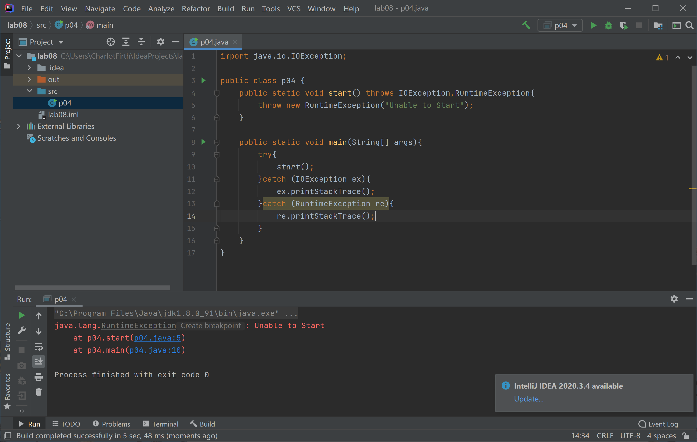
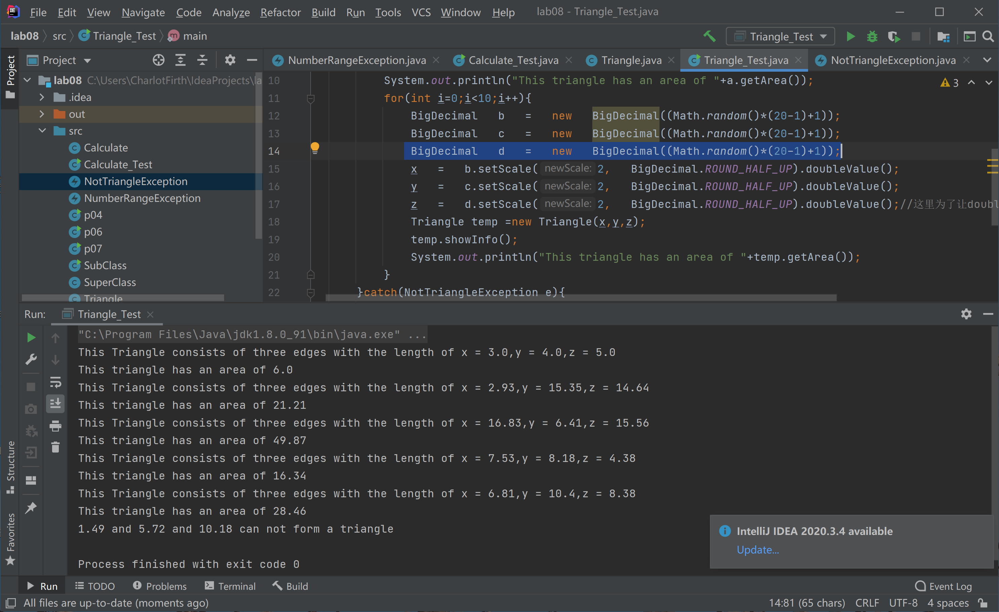

# Java程序设计 LAB08

```java
/**
* 学号:19373073
* 姓名:何潇龙
* JDK版本:jdk1.8.0_91
* 代码文件编码方式:UTF-8
* IDE:IDEA
 */
```

## 1. Java中的检查型异常 `(checked exception)` 和非检查型异常 `(unchecked exception)` 有什么区别？ `简答`

> 受检异常(checked exception)：这些异常在编译时就能被java编译器所检测到异常。除了RuntimeException及其子类以外的其他Exception的子类都是受检异常，这些异常类是编译时可检测的异常。必须采用声明异常或者try、catch方式处理异常。
>
> 非受检异常(unchecked exception)：这些异常只能在程序执行时被检测到，不能在编译时被检测到。非受检异常主要包括RuntimeException及其子类。程序对这类异常可不做处理，交由系统处理；


### 2. 简述Java异常处理中 `throws` 和 `throw` 关键字的作用。 `简答`

> throw是语句抛出一个异常。一般会用于程序出现某种逻辑时程序员主动抛出某种特定类型的异常。
>
> throws是方法可能抛出异常的声明(用在声明方法时，表示该方法可能要抛出异常)。当某个方法可能会抛出某种异常时用于throws 声明可能抛出的异常，然后交给上层调用它的方法程序处理。


### 3. 请列出2个常见的运行时异常和2个非运行时异常。 `简答`

> 运行时异常：
>
> ArithmeticException
>
> NullPointerException
>
> 非运行时异常：
>
> ClassNotFoundException
>
> CloneNotSupportedException


### 4. 指出下列程序的错误并改正。 `改错`

```java
import java.io.IOException;

public class p04 {
    public static void start() throws IOException,RuntimeException{
        throw new RuntimeException("Unable to Start");
    }

    public static void main(String[] args){
        try{
            start();
        }catch (Exception ex){
            ex.printStackTrace();
        }catch (RuntimeException re){
            re.printStackTrace();
        }
    }
}
```

>需要修改的地方：
>
>```java
>catch (Exception ex){
>            ex.printStackTrace();
>}catch (RuntimeException re){
>            re.printStackTrace();
>}
>```
>
>这个地方是没办法捕捉到RuntimeException的，因为它包含在Exception里。
>
>修改方法：
>
>```java
>catch (IOException ex){
>            ex.printStackTrace();
>}catch (RuntimeException re){
>            re.printStackTrace();
>}
>```
>
>执行结果：
>
>


### 5. 指出下列程序的错误并改正。 `改错`

```java
//SuperClass.java
import java.io.IOException;

public class SuperClass {
    public void start() throws IOException{
        throw new IOException("Unable to start");
    }
}

//SubClass.java
import java.io.FileInputStream;

public class SubClass extends SuperClass {
    public void start() throws Exception{
        throw new Exception("Unable to open file");
    }
    public void open(String fileName){
        FileInputStream fis=new FileInputStream(fileName);
    }
}
```

> 重写方法不能抛出比被重写方法范围更大的异常类型。文件无法打开的错误需要得到解决。
>
> ```java
> public void start() throws Exception{
>         throw new Exception("Unable to open file");
> }
> public void open(String fileName){
>     FileInputStream fis=new FileInputStream(fileName);
> }
> ```
>
> 应该被修改为
>
> ```java
> public void start() throws IOException{
>         throw new IOException("Unable to open file");
>     }
> public void open(String fileName)  throws FileNotFoundException{
>     FileInputStream fis=new FileInputStream(fileName);
> }
> ```
>
> 执行结果：
>
> 


### 6. 写出以下程序的输出。 `程序输出`

```java
public class p06 {
    public static void main(String[] args) {
        try {
            methodA();
        } catch (Exception e) {
            methodB();
        }
    }
    private static void methodA() {
        try {
            System.out.println("methodA抛出一个异常！");
            throw new RuntimeException();
        } finally {
            System.out.println("执行methodA的finally!");
        }
    }
    private static void methodB() {
        try {
            System.out.println("methodB执行！");
        } finally {
            System.out.println("执行methodB的finally!");
        }
    }
}
```

> methodA抛出一个异常！
> 执行methodA的finally!
> methodB执行！
> 执行methodB的finally!


### 7. 写出以下程序的输出，试着解释三个函数不同输出的原因。 `程序输出`


```java
public class p07 {
    public static void main(String[] args) {
        System.out.println("-----------------------");
        System.out.println(get0());
        System.out.println("-----------------------");
        System.out.println(get1());
        System.out.println("-----------------------");
        System.out.println(get2());
        System.out.println("-----------------------");
    }
    public static int get0(){
        int i=1;
        try{
            throw new Exception();
        }catch (Exception e){
            System.out.println("error");
            return i;
        }finally {
            i++;
            System.out.println("i in finally block:"+i);
        }
    }
    public static String get1(){
        String i="ok";
        try{
            throw new Exception();
        }catch (Exception e){
            System.out.println("error");
            return i;
        }finally {
            i+="finally";
            System.out.println("i in finally:"+i);
        }
    }
    public static StringBuilder get2(){
        StringBuilder i=new StringBuilder("ok");
        try{
            throw new Exception();
        }catch (Exception e){
            System.out.println("error");
            return i;
        }finally {
            i.append("finally");
            System.out.println("i in finally:"+i);
        }
    }
}
```

> 截图输出结果或者直接复制输出结果，并解释 `get0(), get1(), get2()` 三个函数不同输出的原因
>
> 
>
> 首先finally是在错误中必须执行的语句，而返回会结束程序，因此三个get里finally的内容会先于return输出。
>
> get0里首先i=1，在finally中i加了1，因此finally中打出来是2，但int的对象是固定的，一旦生成一个新的数就会生成一个新的对象，String也是同理，因此return i和finally中的i实际上指向不同的对象，因此finally中返回的是2，而return返回的是0
>
> get1同理，首先i=“ok”，在finally中i加上了“finally”，因此finally中打出来是“okfinally”，但return i和finally中的i实际上指向不同的字符串对象，因此finally中返回的是“okfinally”，而return返回的是原本的“ok”
>
> 但get2中的StringBuilder是个可变类，后面的append也是对同一个对象执行的，因此finally和return的i是同一个对象，打出来都是“okfinally”


### 8. Calculate `编程题`

> 见oo文件夹中的Q08

执行结果：


### 9. Triangle `编程题`

> 见oo文件夹中的Q09

执行结果：



